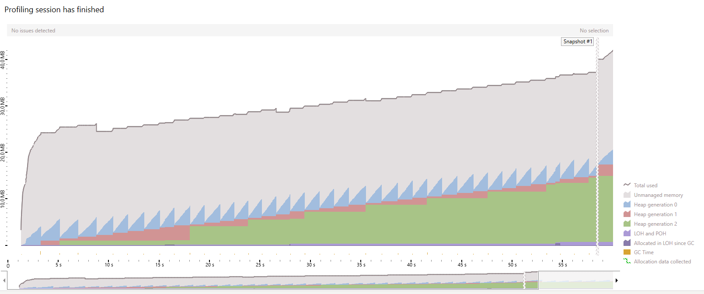
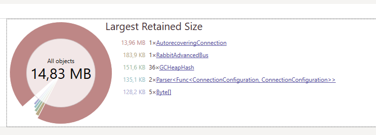
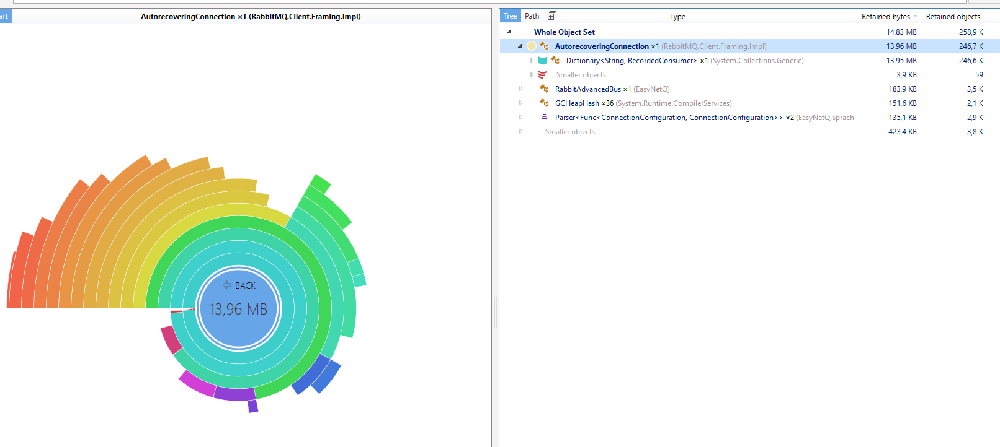
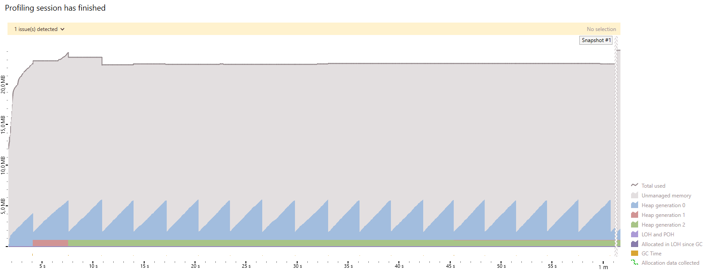

# EasyNetQ consumer memory leak repro

Memory leak reproduction for following scenario:

```c#
using var bus = RabbitHutch.CreateBus("host=localhost;username=guest;password=guest;virtualHost=/;timeout=10");
var exchange = await bus.ExchangeDeclareAsync("memory_leak", ExchangeType.Direct, false, false);

while (true)
{
    var routingKey = Guid.NewGuid().ToString("N");
    var queue = await bus.QueueDeclareAsync($"memory_leak_{routingKey}", false, true, true);
    var binding = await bus.BindAsync(exchange, queue, routingKey);

    // publish 1 message and consume it

    await bus.UnbindAsync(binding);
    await bus.QueueDeleteAsync(queue);
}
```

EasyNetQ version: 6.3.1

RabbitMQ server: 3.9.1 (windows x64 , erlang 24.0, localhost)


Test environment info:

```
dotnet --info
.NET SDK (reflecting any global.json):
 Version:   6.0.100-preview.6.21355.2
 Commit:    7f8e0d76c0

Runtime Environment:
 OS Name:     Windows
 OS Version:  10.0.19043
 OS Platform: Windows
 RID:         win10-x64
 Base Path:   C:\Program Files\dotnet\sdk\6.0.100-preview.6.21355.2\

Host (useful for support):
  Version: 6.0.0-preview.6.21352.12
  Commit:  770d630b28

.NET SDKs installed:
  3.1.202 [C:\Program Files\dotnet\sdk]
  3.1.301 [C:\Program Files\dotnet\sdk]
  3.1.411 [C:\Program Files\dotnet\sdk]
  5.0.104 [C:\Program Files\dotnet\sdk]
  5.0.205 [C:\Program Files\dotnet\sdk]
  5.0.400-preview.21328.4 [C:\Program Files\dotnet\sdk]
  6.0.100-preview.6.21355.2 [C:\Program Files\dotnet\sdk]

.NET runtimes installed:
  Microsoft.AspNetCore.App 3.1.1 [C:\Program Files\dotnet\shared\Microsoft.AspNetCore.App]
  Microsoft.AspNetCore.App 3.1.4 [C:\Program Files\dotnet\shared\Microsoft.AspNetCore.App]
  Microsoft.AspNetCore.App 3.1.5 [C:\Program Files\dotnet\shared\Microsoft.AspNetCore.App]
  Microsoft.AspNetCore.App 3.1.15 [C:\Program Files\dotnet\shared\Microsoft.AspNetCore.App]
  Microsoft.AspNetCore.App 3.1.17 [C:\Program Files\dotnet\shared\Microsoft.AspNetCore.App]
  Microsoft.AspNetCore.App 5.0.4 [C:\Program Files\dotnet\shared\Microsoft.AspNetCore.App]
  Microsoft.AspNetCore.App 5.0.6 [C:\Program Files\dotnet\shared\Microsoft.AspNetCore.App]
  Microsoft.AspNetCore.App 5.0.8 [C:\Program Files\dotnet\shared\Microsoft.AspNetCore.App]
  Microsoft.AspNetCore.App 6.0.0-preview.6.21355.2 [C:\Program Files\dotnet\shared\Microsoft.AspNetCore.App]
  Microsoft.NETCore.App 3.1.1 [C:\Program Files\dotnet\shared\Microsoft.NETCore.App]
  Microsoft.NETCore.App 3.1.4 [C:\Program Files\dotnet\shared\Microsoft.NETCore.App]
  Microsoft.NETCore.App 3.1.5 [C:\Program Files\dotnet\shared\Microsoft.NETCore.App]
  Microsoft.NETCore.App 3.1.15 [C:\Program Files\dotnet\shared\Microsoft.NETCore.App]
  Microsoft.NETCore.App 3.1.17 [C:\Program Files\dotnet\shared\Microsoft.NETCore.App]
  Microsoft.NETCore.App 5.0.4 [C:\Program Files\dotnet\shared\Microsoft.NETCore.App]
  Microsoft.NETCore.App 5.0.6 [C:\Program Files\dotnet\shared\Microsoft.NETCore.App]
  Microsoft.NETCore.App 5.0.8 [C:\Program Files\dotnet\shared\Microsoft.NETCore.App]
  Microsoft.NETCore.App 6.0.0-preview.6.21352.12 [C:\Program Files\dotnet\shared\Microsoft.NETCore.App]
  Microsoft.WindowsDesktop.App 3.0.3 [C:\Program Files\dotnet\shared\Microsoft.WindowsDesktop.App]
  Microsoft.WindowsDesktop.App 3.1.1 [C:\Program Files\dotnet\shared\Microsoft.WindowsDesktop.App]
  Microsoft.WindowsDesktop.App 3.1.4 [C:\Program Files\dotnet\shared\Microsoft.WindowsDesktop.App]
  Microsoft.WindowsDesktop.App 3.1.5 [C:\Program Files\dotnet\shared\Microsoft.WindowsDesktop.App]
  Microsoft.WindowsDesktop.App 3.1.15 [C:\Program Files\dotnet\shared\Microsoft.WindowsDesktop.App]
  Microsoft.WindowsDesktop.App 3.1.17 [C:\Program Files\dotnet\shared\Microsoft.WindowsDesktop.App]
  Microsoft.WindowsDesktop.App 5.0.4 [C:\Program Files\dotnet\shared\Microsoft.WindowsDesktop.App]
  Microsoft.WindowsDesktop.App 5.0.6 [C:\Program Files\dotnet\shared\Microsoft.WindowsDesktop.App]
  Microsoft.WindowsDesktop.App 5.0.8 [C:\Program Files\dotnet\shared\Microsoft.WindowsDesktop.App]
  Microsoft.WindowsDesktop.App 6.0.0-preview.6.21353.1 [C:\Program Files\dotnet\shared\Microsoft.WindowsDesktop.App]
```

# Stream consumer

Consuming messages using regular consumer created with one of `IAdvancedBus.Consume` methods.

[Repro app code](src/StreamConsumer/Program.cs)







Seems like the leak caused by EasyNetQ's `InternalConsumer.Dispose()` implementation which doesn't invoke `IModel.BasicCancel(consumerTag)` method - this method removes consumer's reference from `AutoRecoveringConnection`.

https://github.com/EasyNetQ/EasyNetQ/blob/6.3.1/Source/EasyNetQ/Consumer/InternalConsumer.cs#L351

# Pulling consumer

Consuming messages using regular consumer created with `IAdvancedBus.CreatePullingConsumer` method.

[Repro app code](src/PullingConsumer/Program.cs)



Memory consumption is stable - pulling consumer uses `basic.get` to receive messages.
